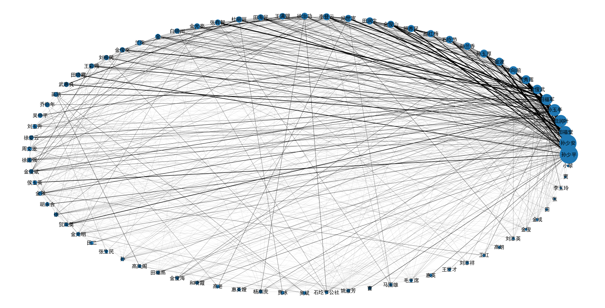

# 小说人名关系提取

## 特点

直接使用hanlp训练好的模型，无专门自定义人名字典
自动人名统计，部分人名简称转换

## 环境

python 3.7
python lib：

- tqdm
- numpy
- networkx
- matplotlib
- pyhanlp

## 使用方法

1. 将书以txt后缀保存在`book`目录下，并且以 utf-8 格式保存

2. 运行如下命令

```bash
python rel.py --book book_name #注意没有txt后缀
```

## 运行结果展示

### 平凡的世界





### 三体


## 分词模型对比

- thulac 清华，大模型下载困难，小模型词性标注效果较差
- jieba 词性标注不好，很容易误分类
- hanlp 功能完整的工具包，分词效果不错
- pynlpir 中科院，标注太奇怪，弃用
- pyltp 哈工大

## 处理过程

增加人名词典，提高人名占比

能否自动发现新的人名？

## 一些值得考虑的问题

**1.对于一个人有多种称呼，如何匹配?**

人名的简称 例如 云天明，天明
附加职称等称谓 例如：汪淼，汪教授，汪淼教授,汪总
附加亲戚关系的 例如：杨母
附加年龄信息的 例如：苏小姐，赵先生，方老太太

暂时的考虑：很难匹配，但是有些是可以匹配的

**2.动态调整字典的效果？**

例如第一遍粗提取，将出现多次的人名加入词典，这时提取的效果就会变好
但是对于偶尔出现的人名怎么处理?

**3.识别结果名称的可信度？**

根据名称列表的长度，每个名字出现的次数，以及切分出的名字的可信度？

## 任务

- [x] 较好的人物信息统计
- [x] 较好的展示人物关系图
- [ ] 人物相关的组织机构等关系提取
- [ ] 人物关系感情色彩和关键词分析
